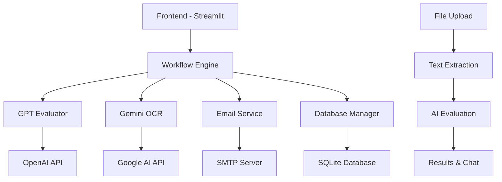

# 🎯 ResumAI - Hệ thống Đánh giá CV bằng AI

<div align="center">


[](https://python.org)
[](https://streamlit.io)
[](https://openai.com)
[](https://ai.google.dev)

**Trợ lý AI tuyển dụng tương tác • Trò chuyện với kết quả đánh giá • Thông tin chi tiết theo thời gian thực**

[🚀 Demo](#demo) • [📖 Tài liệu](#tài-liệu) • [🛠️ Cài đặt](#cài-đặt) • [💡 Tính năng](#tính-năng) • [🤝 Đóng góp](#đóng-góp)

</div>

---

## 📋 Tổng quan

**ResumAI** là một hệ thống đánh giá CV tiên tiến được hỗ trợ bởi AI, cho phép các nhà tuyển dụng tự động hóa quá trình sàng lọc ứng viên một cách thông minh và hiệu quả. Hệ thống tích hợp công nghệ OCR tiên tiến, đánh giá AI và giao diện chat tương tác để mang lại trải nghiệm tuyển dụng hoàn toàn mới.

### 🎯 Vấn đề giải quyết

- **Tiết kiệm thời gian**: Tự động đánh giá hàng trăm CV trong vài phút
- **Đánh giá khách quan**: Loại bỏ bias cá nhân trong quá trình sàng lọc
- **Phân tích sâu**: Cung cấp thông tin chi tiết về từng ứng viên
- **Tương tác thông minh**: Chat AI để khám phá insights từ dữ liệu đánh giá

## ✨ Tính năng

### 🤖 AI Core Features

- **Đánh giá CV thông minh** với GPT-3.5-turbo
- **OCR tiên tiến** sử dụng Google Gemini (hỗ trợ PDF, JPG, PNG, GIF, BMP, TIFF)
- **Chat AI tương tác** để phân tích kết quả đánh giá
- **Chấm điểm tự động** theo tiêu chí tùy chỉnh

### 💼 Recruitment Management

- **Quản lý phiên làm việc** với session titles thông minh
- **Theo dõi tiến trình** đánh giá theo thời gian thực
- **Phân loại ứng viên** tự động (đạt/không đạt yêu cầu)
- **Thống kê chi tiết** và báo cáo tổng hợp

### 📧 Email Automation

- **Email từ chối** tự động với nội dung cá nhân hóa
- **Lời mời phỏng vấn** được lên lịch thông minh
- **Template email** tiếng Việt chuyên nghiệp
- **Theo dõi trạng thái** gửi email

### 📊 Analytics & Insights

- **Dashboard trực quan** với metrics real-time
- **Phân tích xu hướng** ứng viên
- **Export dữ liệu** (JSON, CSV)
- **Lịch sử đánh giá** đầy đủ

### 🔧 Technical Features

- **Database SQLite** tích hợp
- **Session persistence** và recovery
- **File upload** drag-and-drop
- **Responsive design** cho mọi thiết bị

## 🏗️ Kiến trúc hệ thống



## 🛠️ Công nghệ sử dụng

### Core Technologies

- **Backend**: Python 3.8+
- **Web Framework**: Streamlit 1.28+
- **Database**: SQLite với schema migration
- **AI Models**: OpenAI GPT-3.5-turbo, Google Gemini 2.0 Flash Lite

### AI & ML Libraries

- **OpenAI**: GPT-3.5-turbo cho đánh giá CV
- **Google AI**: Gemini cho OCR và text extraction
- **PIL (Pillow)**: Xử lý hình ảnh
- **PyMuPDF**: Xử lý PDF

### Additional Dependencies

- **Email**: SMTP với Gmail support
- **File Processing**: pathlib, uuid
- **Data Processing**: json, pandas
- **UI/UX**: Custom CSS với modern design

## 📦 Cài đặt

### Yêu cầu hệ thống

- Python 3.8 hoặc cao hơn
- 4GB RAM tối thiểu
- 2GB dung lượng trống
- Kết nối internet ổn định

### 1. Clone Repository

```bash
git clone https://github.com/nguyentuongbachhy/ResumAI.git
cd ResumAI
```

### 2. Tạo môi trường ảo

```bash
python -m venv venv

# Windows
venv\Scripts\activate

# macOS/Linux
source venv/bin/activate
```

### 3. Cài đặt dependencies

```bash
pip install -r requirements.txt
```

### 4. Cấu hình môi trường

Tạo file `.env` trong thư mục gốc:

```env
# API Keys
GOOGLE_API_KEY=your_google_api_key_here
OPENAI_API_KEY=your_openai_api_key_here

# Email Configuration (Optional)
SMTP_HOST=smtp.gmail.com
SMTP_PORT=587
SMTP_USER=your_email@gmail.com
SMTP_PASS=your_app_password

# Company Information
COMPANY_NAME=Your Company Name
COMPANY_EMAIL=hr@yourcompany.com

# App Settings
CV_UPLOAD_DIR=./uploads
OUTPUT_DIR=./outputs
TEMP_DIR=./temp
DATABASE_PATH=cv_evaluator.db

# Performance Settings
MAX_CONCURRENT_EVALUATIONS=5
BATCH_SIZE=10
MAX_FILE_SIZE_MB=10
```

### 5. Khởi chạy ứng dụng

```bash
streamlit run app.py
```

Ứng dụng sẽ chạy tại: `http://localhost:8501`

## 🚀 Hướng dẫn sử dụng

### Bước 1: Tạo phiên đánh giá

1. Nhấp **"➕ Tạo mới"** trong sidebar
2. Nhập **mô tả công việc** chi tiết
3. Đặt **tên vị trí** tuyển dụng
4. Chọn **số lượng ứng viên** cần tuyển

### Bước 2: Upload CV

1. Kéo thả hoặc chọn file CV (PDF/Images)
2. Hệ thống sẽ validate file tự động
3. Nhấp **"🚀 Bắt đầu đánh giá AI"**

### Bước 3: Theo dõi quá trình

- Xem tiến trình real-time trong chat
- Theo dõi từng bước: Upload → OCR → Đánh giá → Kết quả

### Bước 4: Phân tích kết quả

- Chat với AI để đặt câu hỏi về ứng viên
- Xem chi tiết đánh giá và ranking
- Export báo cáo (JSON/CSV)

### Bước 5: Thao tác tiếp theo

- Gửi email từ chối/mời phỏng vấn
- Lưu phiên để tham khảo sau
- Tạo báo cáo tổng hợp

## 📖 API Documentation

### Core Services

#### `CVEvaluationWorkflow`

```python
# Khởi tạo workflow
workflow = CVEvaluationWorkflow()

# Chạy đánh giá
result = workflow.run_evaluation(
    session_id="session_123",
    job_description="Job requirements...",
    required_candidates=3,
    uploaded_files=[file1, file2, file3],
    position_title="Software Engineer"
)
```

#### `GPTEvaluator`

```python
# Đánh giá single CV
evaluator = GPTEvaluator()
result = evaluator.evaluate_cv(job_description, cv_text)

# Batch evaluation
results = evaluator.batch_evaluate_cvs(job_description, cv_texts)
```

#### `GeminiOCR`

```python
# Extract text từ file
ocr = GeminiOCR()
text = ocr.extract_text(file_path)

# Batch processing
results = ocr.batch_extract_text(file_paths)
```

### Database Schema

```sql
-- Sessions
CREATE TABLE sessions (
    session_id TEXT PRIMARY KEY,
    session_title TEXT,
    job_description TEXT,
    position_title TEXT,
    required_candidates INTEGER,
    created_at TIMESTAMP
);

-- Files
CREATE TABLE files (
    id INTEGER PRIMARY KEY,
    session_id TEXT,
    filename TEXT,
    extracted_text TEXT,
    processing_status TEXT,
    FOREIGN KEY (session_id) REFERENCES sessions (session_id)
);

-- Evaluations
CREATE TABLE evaluations (
    id INTEGER PRIMARY KEY,
    session_id TEXT,
    file_id INTEGER,
    score REAL,
    evaluation_json TEXT,
    is_qualified BOOLEAN,
    FOREIGN KEY (session_id) REFERENCES sessions (session_id),
    FOREIGN KEY (file_id) REFERENCES files (id)
);
```

## 🔧 Cấu hình nâng cao

### Email Templates

Tùy chỉnh email templates trong `email_service.py`:

```python
def create_interview_invitation_email(self, candidate_name, position, interview_date, score):
    # Customize email content here
    subject = f"Thư mời phỏng vấn vị trí {position}"
    body = f"""
    Kính chào {candidate_name},

    Chúng tôi vui mừng thông báo...
    """
    return subject, body
```

### Scoring Criteria

Điều chỉnh tiêu chí chấm điểm trong `gpt_evaluator.py`:

```python
def _create_evaluation_prompt(self, job_description, cv_text):
    # Customize evaluation criteria
    prompt = f"""
    Đánh giá CV theo các tiêu chí:
    1. Phù hợp với yêu cầu (40%)
    2. Kinh nghiệm (30%)
    3. Kỹ năng (20%)
    4. Học vấn (10%)
    """
```

## 🧪 Testing

### Chạy unit tests

```bash
python -m pytest tests/ -v
```

### Test individual components

```bash
# Test OCR
python -c "from gemini_ocr import gemini_ocr; print(gemini_ocr.extract_text('sample.pdf'))"

# Test GPT evaluation
python -c "from gpt_evaluator import get_gpt_evaluator; evaluator = get_gpt_evaluator(); print(evaluator.test_connection())"

# Test email service
python -c "from email_service import email_service; print(email_service.test_email_connection())"
```

## 📈 Performance

### Benchmarks

- **OCR Speed**: ~15 giây/file (PDF 2-3 trang)
- **Evaluation Speed**: ~10 giây/CV với GPT-3.5-turbo
- **Concurrent Processing**: Hỗ trợ 5 files đồng thời
- **Database**: SQLite với indexing cho truy vấn nhanh

### Optimization Tips

- Sử dụng file ảnh chất lượng cao cho OCR tốt hơn
- Batch processing cho nhiều CV cùng lúc
- Cache kết quả để tránh re-evaluation
- Monitor API usage để tối ưu chi phí

## 🤝 Đóng góp

Chúng tôi hoan nghênh mọi đóng góp! Xem [CONTRIBUTING.md](CONTRIBUTING.md) để biết chi tiết.

### Development Setup

```bash
# Install development dependencies
pip install -r requirements-dev.txt

# Install pre-commit hooks
pre-commit install

# Run linting
flake8 src/
black src/

# Run type checking
mypy src/
```

### Roadmap

- [ ] **Multi-language support** (English, Vietnamese)
- [ ] **Advanced ML models** integration
- [ ] **REST API** cho third-party integration
- [ ] **Docker containerization**
- [ ] **Cloud deployment** support
- [ ] **Advanced analytics** dashboard
- [ ] **Interview scheduling** integration
- [ ] **Video CV** processing

## 📄 License

Dự án này được phát hành dưới [MIT License](LICENSE).

```
MIT License

Copyright (c) 2024 ResumAI Team

Permission is hereby granted, free of charge, to any person obtaining a copy
of this software and associated documentation files...
```

## 🙏 Acknowledgments

- **OpenAI** cho GPT-3.5-turbo API
- **Google AI** cho Gemini OCR capabilities
- **Streamlit** cho framework tuyệt vời
- **Python Community** cho các thư viện hỗ trợ

## 📞 Hỗ trợ

### Liên hệ

- **Email**: nguyentuongbachhy@gmail.com
- **GitHub Issues**: [Report Bug](https://github.com/nguyentuongbachhy/ResumAI/issues)
- **Discussions**: [GitHub Discussions](https://github.com/nguyentuongbachhy/ResumAI/discussions)

### FAQ

**Q: Hệ thống có hỗ trợ tiếng Việt không?**
A: Có, ResumAI được thiết kế đặc biệt cho thị trường Việt Nam với UI và AI responses hoàn toàn bằng tiếng Việt.

**Q: Tôi có thể tự host không?**
A: Có, ResumAI có thể chạy on-premise. Chỉ cần cấu hình API keys và môi trường phù hợp.

**Q: Chi phí API là bao nhiều?**
A: Chi phí phụ thuộc vào usage. Ước tính ~$0.01-0.03 per CV cho OpenAI + Gemini APIs.

**Q: Dữ liệu có được bảo mật không?**
A: Có, tất cả dữ liệu được lưu trữ local trong SQLite database. API calls được encrypt.

---

<div align="center">

**⭐ Star repo này nếu bạn thấy hữu ích! ⭐**

Made with ❤️ by [Nguyen Tuong Bach Hy](https://github.com/nguyentuongbachhy)

</div>
